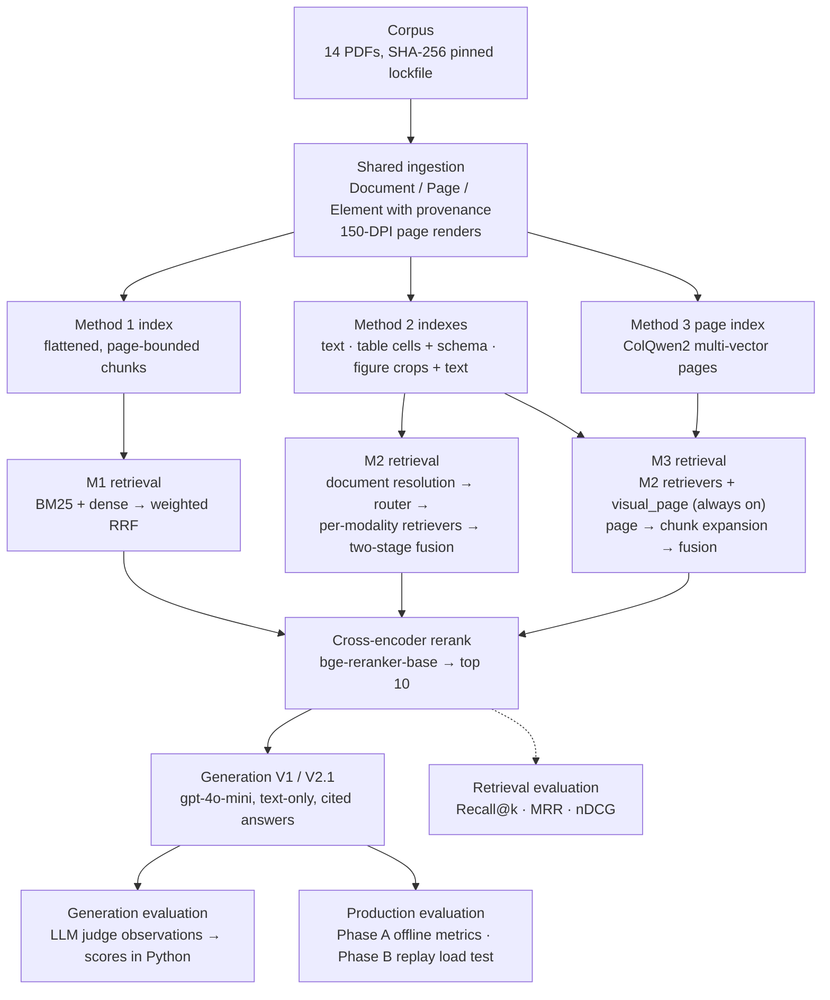

# Multimodal RAG Benchmark

Three retrieval-augmented generation architectures, built on **one shared
ingestion layer** and evaluated on **one fixed multimodal corpus**, so their
differences are attributable to retrieval architecture rather than to parsing,
data or generator.

> When documents contain text, tables, charts and diagrams, what does preserving
> each modality — or retrieving over the rendered page itself — actually buy over
> flattening everything to text? For which kinds of question, and at what latency
> and cost?

This is an AI/ML engineering project, not a state-of-the-art claim. The
evaluation exists to make design trade-offs measurable: retrieval quality,
grounded answer quality, latency, token cost, failure modes and behaviour under
concurrent load, each with its limitations stated.

| | |
|---|---|
| **Corpus** | 14 pinned PDFs across finance, policy, health, technical and scientific documents — 1,620 pages, 951 after page caps |
| **Retrieval gold set** | 42 hand-verified queries, 43 page-level evidence entries |
| **Generation gold set** | 105 atomic reference facts for the 42 queries, plus 8 unanswerable questions |
| **Evaluation** | retrieval metrics · LLM-judged generation · offline production metrics · replay load test |
| **Tests** | 1,037 offline tests (`pytest -m "not integration and not llm and not slow"`) |

Detailed design notes and the complete evaluation record are in
[`docs/design_and_results.md`](docs/design_and_results.md); production
methodology and results in [`docs/production.md`](docs/production.md); component
ownership in [`docs/architecture.md`](docs/architecture.md).

---

## Architecture

The three methods are **configurations of one system**. Every method reads the
same parsed elements, is reranked by the same cross-encoder, and answers through
the same text-only generator, so a difference in results comes from how evidence
is indexed and retrieved.



| Layer | Module | Responsibility |
|---|---|---|
| Ingestion | `ingestion/`, `textify/` | PDF → `Document` / `Page` / `Element` with bounding boxes; flattening and chunking |
| Indexing | `indexing/`, `stores/`, `embeddings/` | Text, table, figure and visual page indexes over Postgres, Qdrant, BM25 and a file-based multi-vector store |
| Retrieval | `retrieval/`, `engine.py` | `Retriever` protocol, router, fusion, reranker; `RAGEngine` composes whatever retrievers it is given |
| Generation | `generation/` | Provider interface, Generation V1 and V2.1, citation resolution, answer validation |
| Methods | `methods/` | Named configurations: which indexes and retrievers each method uses |
| Evaluation | `evaluation/`, `production/` | Gold sets, metrics, LLM judge, response cache, production metrics, load testing |

Adding a retrieval signal means implementing one protocol and registering it.
Method 3 is exactly that: Method 2's configuration plus one retriever.

---

## Three Architectures

| | Method 1 — Textified RAG | Method 2 — Modality-Aware RAG | Method 3 — Hybrid Visual RAG |
|---|---|---|---|
| **Idea** | Flatten every modality to text, retrieve once | Keep each modality native, route the query | Add late-interaction retrieval over rendered page images |
| **Retrieval unit** | Page-bounded text chunks (384 target tokens, 64 overlap); each table and figure its own flattened chunk | Same text chunks; tables and figures keep their native representations | Method 2's chunks; a retrieved page contributes its chunks |
| **Text** | BM25 + dense (`bge-small-en-v1.5`) | BM25 + dense | BM25 + dense |
| **Tables** | Markdown text | BM25 over cells + dense over schema | as Method 2 |
| **Figures** | Caption + OCR text | CLIP ViT-B/32 over figure crops + BM25 over figure text | as Method 2, plus ColQwen2 page vectors |
| **Query handling** | — | Heuristic router, document/metadata resolution | as Method 2, `visual_page` always fires |
| **Fusion** | Weighted RRF over two retrievers | Best route within each modality, weighted RRF across | Method 2's fusion with the page signal |
| **Rerank** | `bge-reranker-base` over 25 candidates | same, over a modality-floored pool | same |
| **Generator** | text-only | text-only | text-only |

**Method 1** is the baseline: the simplest pipeline that could work, which
measures the cost of flattening. It is frozen as measured.

**Method 2** gives each modality a specialised retriever. A table can be found by
a cell value ("which table contains 22,360") or by what it is about; a figure by
its visual content even without extractable text. Fusion runs within each
modality first and across modalities second, and the reranking pool guarantees
every fired modality a floor, so the cross-encoder can arbitrate between them.

**Method 3** keeps Method 2's retrievers unchanged and adds ColQwen2 retrieval
over the 150-DPI page renders: a 128-d vector per image patch, scored against one
vector per query token by late interaction. A retrieved page is expanded into the
existing Method 2 chunks on that page, which keeps provenance exact and the gold
set, reranker, generator and judge shared. **This is visual retrieval, not
multimodal generation**: the generator still reads text.

---

## Corpus & Infrastructure

**Corpus.** Fourteen documents chosen so every modality is genuinely stressed:
multi-level financial tables (Berkshire Hathaway, Federal Reserve, ECB), composite
policy figures (IPCC, EIA), technical diagrams and register maps (NASA, RP2040,
NVIDIA), a short health report (WHO), and scientific papers (Attention, RAG,
ColPali, TAPAS, AlphaFold). PDFs are not redistributed: `configs/corpus.yaml`
records sources and licences, and `configs/corpus.lock.yaml` pins each file's
SHA-256, size and page count.

| | |
|---|---|
| Documents | 14 |
| Source pages | 1,620 (951 after `page_limit` caps on two long documents) |
| Page renders | 150 DPI |
| Method 1 chunks | 2,947 — 2,174 text, 445 table, 328 figure |
| Method 2 / 3 chunks | 2,984 — 2,174 text, 445 table, 365 figure |

**Infrastructure.** PostgreSQL (elements and document metadata), Qdrant (dense
vectors), `bm25s`, `bge-small-en-v1.5`, CLIP ViT-B/32, `bge-reranker-base` and
ColQwen2 (`vidore/colqwen2-v1.0`), with Postgres and Qdrant run through Docker
Compose. Everything except Method 3's ColQwen2 encoding runs on CPU: the page
index (951 pages) and the evaluation query embeddings were built on a Colab T4
GPU and copied back. Only generation and judging call a provider
(`gpt-4o-mini`), behind a swappable interface.

---

## Evaluation Framework

| Layer | What it measures | How |
|---|---|---|
| **Retrieval** | Whether gold evidence is found and how highly it ranks | Recall@k, MRR, nDCG@10 against page-level evidence `(doc_id, page, modality)`; offline, free, deterministic |
| **Generation** | Whether the answer is correct and grounded in the retrieved sources | Answers generated from the *exact* chunks each saved retrieval run scored; `gpt-4o-mini`, temperature 0, seed 42, 1,024 output tokens; content-addressed response cache |
| **Judge** | Claim support, fact coverage, refusal | The judge returns observations only; correctness, completeness and grounded correctness are computed in Python |
| **Production — Phase A** | Latency by stage, tokens, cost, errors, failure decomposition | Recorded run artefacts plus offline re-measurement of prompt construction, checked by prompt SHA-256 |
| **Production — Phase B** | Throughput and latency under concurrency | In-process load test of `method.answer(...)` at concurrency 1 / 5 / 10, with provider calls replayed from recorded runs |

Metric definitions used below:

- **grounded correct** — every reference fact covered, nothing contradicted, and
  every claim supported by the sources;
- **correctness** — 1 if all facts are covered, 0.5 if some, 0 if none or any is
  contradicted; refusals excluded;
- **completeness** — fraction of reference facts covered;
- **composed e2e latency** (Phase A) — a sum of separately measured components,
  not a single-process measurement;
- **e2e latency** (Phase B) — measured wall-clock time around `method.answer(...)`
  in one process, excluding queue wait; no HTTP layer.

---

## Results

All numbers come from recorded run files and are reported without ranking. With
42 answerable questions and slices of 12–15, differences of a few questions are
directional, not statistically significant.

### Retrieval

Macro-averaged over 42 queries; every method reranks with the same cross-encoder.

| run | Recall@1 | Recall@5 | Recall@10 | MRR | nDCG@10 |
|---|---:|---:|---:|---:|---:|
| Method 1 | 0.4048 | 0.7619 | 0.8810 | 0.5552 | 0.6333 |
| Method 2 | 0.4048 | 0.7857 | 0.9286 | 0.5706 | 0.6565 |
| Method 2, `--no-metadata` | 0.4048 | 0.7857 | 0.9286 | 0.5687 | 0.6548 |
| Method 3 | 0.4048 | 0.7619 | 0.9524 | 0.5635 | 0.6553 |

Recall@10 by where the answer lives:

| run | text (n=15) | table (n=12) | figure (n=15) |
|---|---:|---:|---:|
| Method 1 | 1.000 | 1.000 | 0.667 |
| Method 2 | 1.000 | 1.000 | 0.800 |
| Method 3 | 0.933 | 1.000 | 0.933 |

### Generation (V2.1, the frozen final pipeline)

Over 42 answerable and 8 unanswerable questions. The V1 column is the same-day,
cache-bypassed V1 control generated from the same retrieval runs.

| run | gold evidence in prompt | grounded correct, end to end | same-day V1 | correctness | completeness | unanswerable refused |
|---|---:|---:|---:|---:|---:|---:|
| Method 1 | 37/42 | 26/42 (0.6190) | 15/42 (0.3571) | 0.7439 | 0.7520 | 8/8 |
| Method 2 | 39/42 | 24/42 (0.5714) | 22/42 (0.5238) | 0.7195 | 0.7274 | 8/8 |
| Method 2, `--no-metadata` | 39/42 | 25/42 (0.5952) | — | 0.7262 | 0.7472 | 8/8 |
| Method 3 | 40/42 | 26/42 (0.6190) | 20/42 (0.4762) | 0.7500 | 0.7829 | 8/8 |

Re-running identical V1 prompts moved grounded correctness by up to three
questions (the provider backend changed between runs), so **about ±3 of 42 is
run-to-run noise**. V2.1 caveats — its rules were designed from failures on this
same question set, and its uncited-claim rate is higher than V1's — are in
[`docs/design_and_results.md`](docs/design_and_results.md#results).

### Production — Phase A (offline, composed)

Composed e2e latency over answerable queries with uncached generation records.
Cost is provider-reported token usage at the configured evaluation rates in
`configs/pricing.yaml` ($0.15 / $0.60 per 1M input / output tokens): an estimate,
not a billing statement.

| run | pipeline | n | composed e2e p50 / p95 / p99 (s) | rerank p50 (s) | $ / 1K queries |
|---|---|---:|---|---:|---:|
| Method 1 | V1 | 42 | 20.440 / 26.826 / 28.722 | 18.23 | 0.558 |
| Method 2 | V1 | 42 | 19.542 / 21.096 / 22.363 | 17.62 | 0.566 |
| Method 3 | V1 | 42 | 19.925 / 29.882 / 42.061 | 17.45 | 0.557 |
| Method 1 | V2.1 | 42 | 20.351 / 27.142 / 29.837 | 18.23 | 0.613 |
| Method 2 | V2.1 | 35 | 19.778 / 21.908 / 23.233 | 17.62 | 0.621 |
| Method 3 | V2.1 | 35 | 20.446 / 22.209 / 26.731 | 17.45 | 0.612 |

Prompt construction took about 2 ms and post-processing under 1 ms per query.
There were no generation errors, runner-level retries or timeouts in any run
(50 requests each); retries inside the provider SDK are not observable offline.

### Production — Phase B (replay load test)

`mmrag prod load --methods method1,method2,method3 --concurrency 1,5,10 --limit 20 --warmup 2 --cooldown-s 5`
— 180 requests, 180 OK, 180/180 prompts byte-identical to the evaluated runs.
Replay mode, in-process, CPU-only, one 20-request sample per level.

| method | c | RPS | e2e p50 (s) | e2e p95 (s) | rerank p50 (s) |
|---|---:|---:|---:|---:|---:|
| Method 1 | 1 | 0.0451 | 18.624 | 31.490 | 17.095 |
| Method 1 | 5 | 0.0666 | 70.204 | 79.201 | 64.211 |
| Method 1 | 10 | 0.0628 | 153.278 | 159.026 | 142.651 |
| Method 2 | 1 | 0.0558 | 18.335 | 20.596 | 16.703 |
| Method 2 | 5 | 0.0692 | 71.147 | 87.160 | 57.760 |
| Method 2 | 10 | 0.0669 | 134.405 | 168.232 | 103.094 |
| Method 3 | 1 | 0.0527 | 18.953 | 22.947 | 16.541 |
| Method 3 | 5 | 0.0675 | 67.691 | 86.833 | 55.440 |
| Method 3 | 10 | 0.0652 | 138.286 | 165.533 | 107.055 |

Stage breakdowns, resource usage, validity checks and every caveat are in
[`docs/production.md`](docs/production.md).

---

## Engineering Findings

**Retrieval**

- **Modality-aware retrieval raised figure Recall@10 from 0.667 (Method 1) to
  0.800 (Method 2)**; text and table recall were already saturated. On 15 figure
  queries, that is two queries.
- **Visual page retrieval produced the highest measured Recall@10 (0.9524), but
  not the highest MRR or Recall@5.** Against Method 2 it gained two figure queries
  and lost one text query, where page-expanded chunks displaced the gold chunk
  from the 25-candidate rerank pool.
- **The evaluation harness paid for itself before Method 3 existed.** Method 2's
  first measured Recall@10 was 0.595. A corpus error (a lockfile entry pointing at
  the wrong paper), over-eager document resolution and summed within-modality
  fusion were found and fixed, taking it to 0.929 — none of them a change to the
  modality-aware design.

**Generation**

- **Better retrieval did not translate one-for-one into better answers.** Method 3
  put gold evidence in the prompt for 40 of 42 questions and Method 1 for 37, yet
  both reached 26 grounded-correct answers under V2.1.
- **V2.1 improved grounded correctness over same-day V1 controls for Methods 1
  and 3 by more than run-to-run noise** (15 → 26 and 20 → 26); Method 2's
  change (22 → 24) is within noise. Most V1 failures were partial answers whose
  missing facts were already in the prompt. Backend drift, design on the test
  set and a higher uncited-claim rate qualify these gains.
- **V2.1 generation costs roughly 10% more than V1** ($0.612–0.621 vs
  $0.557–0.566 per 1K queries), from longer answers and slightly longer prompts.

**Production**

- **The CPU cross-encoder dominates latency**: 17.5–18.2 s of a 19.5–20.9 s
  median composed request; prompt construction and post-processing are
  negligible by comparison.
- **In the replay load test, throughput rose from c = 1 to c = 5 and was
  approximately flat at c = 10 in this single run**, while median latency grew
  from about 18–19 s to 134–153 s. The machine was CPU-saturated; reranking and
  first-stage retrieval both contended for the same cores. Part of the c = 1 → 5
  gain is overlapping replayed generation time rather than a serving improvement.

---

## Reproducibility

**Setup** (Python 3.10–3.12, Docker):

```bash
python -m pip install -e ".[openai,dev]"
cp .env.example .env              # set OPENAI_API_KEY; only generation and judging need it
docker compose up -d              # Postgres (5433) + Qdrant (6333)
mmrag doctor
```

**Corpus, ingestion and indexes:**

```bash
mmrag corpus download             # 14 PDFs into data/raw/, verified against the lockfile
mmrag corpus verify
mmrag ingest run
mmrag index build --config method1
mmrag index build --config method2
```

Method 3's page index needs a GPU (`mmrag index build --config method3 --device cuda`
and `mmrag index embed-queries --config method3 --device cuda`); the Colab
workflow is in [`docs/m3_colab.md`](docs/m3_colab.md). Check it with
`mmrag index status --config method3`.

**Retrieval evaluation** (offline, no API key):

```bash
mmrag eval validate
mmrag eval run -c method1 --tag rerank
mmrag eval run -c method2 --tag rerank
mmrag eval run -c method2 --no-metadata --tag rerank-nometa
mmrag eval run -c method3 --tag rerank
mmrag eval compare data/eval/runs/*.json
```

**Generation evaluation** (paid provider calls; `--dry-run` projects cost and calls nothing):

```bash
mmrag eval generate --retrieval-run data/eval/runs/<run>.json --pipeline v2.1
mmrag eval judge --generation-run data/eval/generation/<run>_generation.json
mmrag eval compare data/eval/generation/*_judged.json --markdown
```

**Production evaluation** (no provider calls):

```bash
mmrag prod report --generation-run data/eval/generation/<run>_generation.json \
    --judged-run data/eval/generation/<run>_judged.json
mmrag prod compare data/eval/production/*_production.json
mmrag prod load --methods method1,method2,method3 --concurrency 1,5,10 \
    --limit 20 --warmup 2 --cooldown-s 5
```

**Tests** (offline; no services, models or API key):

```bash
pytest -m "not integration and not llm and not slow"
```

**What is and is not committed.** Configs, the corpus manifest and lockfile, and
the gold sets are committed. Retrieval, generation and judged runs, the LLM
response cache, indexes, the Method 3 page index and production outputs are
gitignored; the tables in this README and `docs/` are the committed record.
Recorded provider spend was small — about $0.14 to generate and judge the first
three V1 arms, and at most about $0.28 for V2.1 across four arms (see
[`docs/design_and_results.md`](docs/design_and_results.md)).

---

## Limitations

- **One fixed corpus and a small gold set.** 14 documents and 42 answerable
  questions; per-modality slices hold 12–15 queries. Results show how these
  architectures behave here, not in general.
- **LLM judge.** The judge is the same model as the generator (`gpt-4o-mini`), so
  absolute faithfulness and grounding scores are likely lenient; comparisons
  between arms are sturdier than absolute values. Six generation-gold entries
  remain marked NEEDS REVIEW.
- **Backend and model drift.** Seed 42 does not pin output across provider
  backend changes; identical V1 prompts reproduced only 32–33 of 50 answers. V2.1
  was designed from failures on the same question set it is evaluated on.
- **Figures reach the generator as text.** All three methods use a text-only
  generator; Method 3 changes what is retrieved, not what the model sees.
- **CPU-only production environment.** Latency and throughput reflect one
  16-core, 15.7 GB development machine with a CPU cross-encoder.
- **Replay load test, not a live or HTTP benchmark.** Provider calls were replayed
  from recorded runs, so provider-side concurrency, rate limits and retries were
  not measured, and no HTTP or serialisation layer was included.
- **Single load sample per concurrency level.** One 20-request run per level, in
  fixed order; p95/p99 over 20 samples are unstable.
- **Process-level memory confounds.** Methods ran sequentially in one process, so
  RSS is not comparable across methods, and system memory was under pressure
  (89–100% used).
- **Composed Phase A latency** is a sum of separately measured components, and
  Method 3 latency excludes ColQwen2 query encoding (query embeddings were
  precomputed).

---

## Project Structure

```
configs/                  experiment configs (default + method1/2/3), corpus manifest + lockfile, pricing
data/eval/gold/           retrieval and generation gold sets (committed)
docs/                     design and results, production evaluation, architecture, Method 3 Colab workflow
scripts/                  Postgres schema, Method 3 GPU runner
src/mmrag/
  ingestion/  textify/    PDF → elements with provenance; flattening and chunking
  embeddings/ stores/     text / CLIP / ColQwen2 embedders; Postgres, Qdrant, BM25, multi-vector store
  indexing/               modality indexes and the visual page index
  retrieval/  engine.py   Retriever protocol, router, fusion, reranker; RAGEngine
  generation/             providers, Generation V1 and V2.1, validation
  methods/                Method 1 / 2 / 3 configurations
  evaluation/             gold sets, retrieval metrics, generation runner, LLM judge, cache, reports
  production/             Phase A production metrics, Phase B load testing
  cli.py                  the `mmrag` command line
tests/                    offline test suite
```

---

## Future Work

Not part of this project's scope, and not implemented:

- **HTTP serving** — a thin API around `method.answer(...)` and an HTTP load test.
- **Live-provider load testing** — real provider latency, rate limits and retries
  under concurrency (the load test's live mode exists but was not run).
- **Concurrency control** — bounding concurrent reranking to trade throughput for
  tail latency on CPU.
- **Observability** — request tracing and stage-level telemetry.

---

## Licence

MIT for the code in this repository. The corpus documents remain under their own
licences, recorded per entry in `configs/corpus.yaml`; none are redistributed here.

Author: Sadaf.
